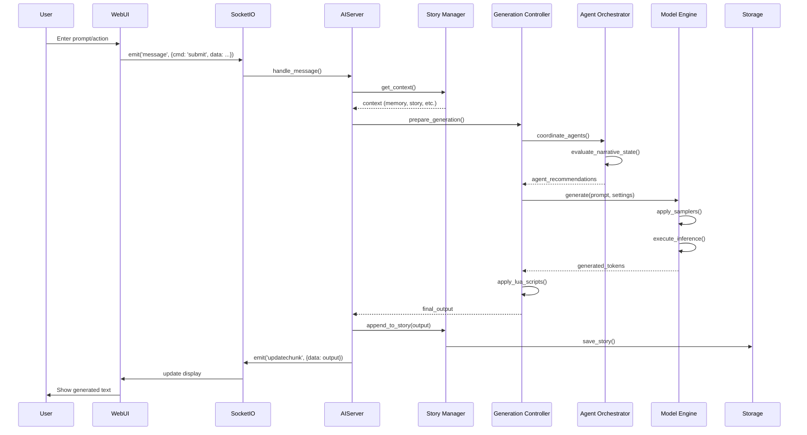

# KoboldAI System Architecture Overview

## Executive Summary

KoboldAI is a sophisticated browser-based AI-assisted writing platform that integrates multiple AI models, cognitive architectures (OpenCog), and real-time collaborative story generation. The system provides a full-stack architecture supporting local models, cloud APIs, and advanced autonomous agent orchestration.

**Version:** 1.19.2  
**Language:** Python 3.8+  
**Framework:** Flask + SocketIO (WebSocket)  
**AI Backend:** HuggingFace Transformers, PyTorch, TPU/MTJ  
**Architecture Style:** Event-driven, Plugin-based

---

## Technology Stack

### Backend Technologies
- **Web Framework**: Flask 2.3.3 with Flask-SocketIO 5.3.2
- **AI/ML Libraries**: 
  - PyTorch 2.1.x
  - Transformers 4.36.1
  - Accelerate 0.25.0
  - PEFT 0.7.1 (Parameter-Efficient Fine-Tuning)
- **Model Optimization**:
  - AutoGPTQ (Quantization)
  - AutoAWQ (Activation-aware Weight Quantization)
  - ExLlama/ExLlamaV2 (Fast inference)
  - BitsAndBytes (Quantization)
- **Scripting**: Lua 5.4 (via lupa) for userscripts
- **Storage**: File-based JSON, ZIP archives

### External Integrations
- **AI Services**: OpenAI, GooseAI, AI Horde
- **Model Hub**: HuggingFace Hub
- **Network Tunneling**: Cloudflare, ngrok, localtunnel
- **Hardware**: CUDA 11.8, ROCm (AMD), Intel IPEX (ARC GPUs)

### Cognitive Architecture
- **OpenCog Integration**: Autonomous agent orchestration
- **Components**: Agent orchestrator, narrative engine, world builder, adventure telos

---

## High-Level System Architecture

```mermaid
graph TB
    subgraph "Client Layer"
        Browser[Web Browser]
        WebUI[Web Interface]
        SocketClient[SocketIO Client]
    end

    subgraph "Application Layer"
        Flask[Flask Web Server]
        SocketIO[Flask-SocketIO]
        APIEndpoint[REST API /api]
        
        Flask --> SocketIO
        Flask --> APIEndpoint
    end

    subgraph "Core Business Logic"
        AIServer[aiserver.py - Main Controller]
        StoryManager[Story Management]
        WorldInfo[World Info System]
        MemorySystem[Memory & Context]
        GenerationController[Generation Controller]
        
        AIServer --> StoryManager
        AIServer --> WorldInfo
        AIServer --> MemorySystem
        AIServer --> GenerationController
    end

    subgraph "OpenCog Integration"
        Orchestrator[Agent Orchestrator]
        NarrativeEngine[Narrative Engine]
        WorldBuilder[World Builder]
        AdventureTelos[Adventure Telos]
        
        Orchestrator --> NarrativeEngine
        Orchestrator --> WorldBuilder
        Orchestrator --> AdventureTelos
    end

    subgraph "AI Model Layer"
        ModelLoader[Model Loader]
        InferenceEngine[Inference Engine]
        Tokenizer[Tokenizer]
        Samplers[Sampling Strategies]
        
        ModelLoader --> InferenceEngine
        InferenceEngine --> Tokenizer
        InferenceEngine --> Samplers
    end

    subgraph "Model Backends"
        HFTorch[HuggingFace Torch]
        HFMtj[HuggingFace TPU/MTJ]
        ExLlama[ExLlama/V2]
        API[API Backends]
        Horde[AI Horde]
        
        InferenceEngine --> HFTorch
        InferenceEngine --> HFMtj
        InferenceEngine --> ExLlama
        InferenceEngine --> API
        InferenceEngine --> Horde
    end

    subgraph "Scripting & Extensions"
        LuaEngine[Lua 5.4 Engine]
        UserScripts[User Scripts]
        Softprompts[Soft Prompts]
        
        LuaEngine --> UserScripts
    end

    subgraph "Storage Layer"
        FileOps[File Operations]
        StoryFiles[(Story Files .json)]
        ConfigFiles[(Configuration)]
        ModelCache[(Model Cache)]
        
        FileOps --> StoryFiles
        FileOps --> ConfigFiles
        FileOps --> ModelCache
    end

    Browser --> WebUI
    WebUI --> SocketClient
    SocketClient <--> SocketIO
    Browser <--> APIEndpoint

    SocketIO --> AIServer
    APIEndpoint --> AIServer
    
    GenerationController --> ModelLoader
    GenerationController --> LuaEngine
    GenerationController --> Orchestrator
    
    AIServer --> FileOps
    
    StoryManager --> FileOps
    MemorySystem --> FileOps
    
    Softprompts --> InferenceEngine
    
    style "OpenCog Integration" fill:#e1f5ff
    style "AI Model Layer" fill:#fff4e1
    style "Client Layer" fill:#f0f0f0
    style "Storage Layer" fill:#e8f5e9
```

---

## Component Interaction Flow



---

## Data Flow Architecture

```mermaid
graph LR
    subgraph "Input Processing"
        UserInput[User Input]
        Memory[Memory Context]
        AuthorsNote[Author's Note]
        WorldInfo[World Info]
        StoryHistory[Story History]
    end

    subgraph "Context Assembly"
        ContextBuilder[Context Builder]
        TokenBudget[Token Budget Manager]
    end

    subgraph "Generation Pipeline"
        Preprocessor[Pre-processors]
        ModelInference[Model Inference]
        Postprocessor[Post-processors]
        LuaHooks[Lua Script Hooks]
    end

    subgraph "Output Processing"
        TextFormatter[Text Formatter]
        Validator[Output Validator]
        Trimmer[Sentence Trimmer]
    end

    subgraph "State Management"
        StoryState[Story State]
        SessionState[Session State]
        ModelState[Model State]
    end

    UserInput --> ContextBuilder
    Memory --> ContextBuilder
    AuthorsNote --> ContextBuilder
    WorldInfo --> ContextBuilder
    StoryHistory --> ContextBuilder

    ContextBuilder --> TokenBudget
    TokenBudget --> Preprocessor

    Preprocessor --> LuaHooks
    LuaHooks --> ModelInference
    ModelInference --> Postprocessor
    Postprocessor --> LuaHooks

    LuaHooks --> TextFormatter
    TextFormatter --> Validator
    Validator --> Trimmer

    Trimmer --> StoryState
    Trimmer --> SessionState

    StoryState --> StoryHistory
    SessionState --> Memory

    ModelState --> ModelInference

    style "Context Assembly" fill:#e3f2fd
    style "Generation Pipeline" fill:#fff3e0
    style "Output Processing" fill:#f3e5f5
    style "State Management" fill:#e8f5e9
```

---

## Model Backend Architecture

```mermaid
graph TB
    subgraph "Model Selection & Loading"
        ModelMenu[Model Menu/Selection]
        ModelPath[Model Path Resolution]
        ModelDownload[HF Hub Download]
    end

    subgraph "Model Backends"
        HFBasic[Basic HF]
        HFTorch[HF Torch]
        HFMTJ[HF TPU/MTJ]
        ExLlamaV2[ExLlamaV2]
        ExLlama[ExLlama]
        GPTQ[AutoGPTQ]
        AWQ[AutoAWQ]
        KoboldCPP[KoboldCPP]
        ReadOnly[Read-Only]
        APIBackend[API Backend]
        OpenAI[OpenAI]
        GooseAI[GooseAI]
        Horde[AI Horde]
    end

    subgraph "Inference Engine"
        InferenceModel[InferenceModel Base Class]
        GenSettings[Generation Settings]
        Stoppers[Stopping Criteria]
        LogitsProc[Logits Processors]
        Warpers[Warpers/Samplers]
        PostTokenHooks[Post-Token Hooks]
    end

    subgraph "Hardware Optimizations"
        CUDA[CUDA Support]
        ROCm[ROCm AMD]
        IPEX[Intel IPEX]
        CPU[CPU Fallback]
        Breakmodel[Breakmodel Multi-GPU]
    end

    ModelMenu --> ModelPath
    ModelPath --> ModelDownload
    ModelDownload --> HFBasic
    ModelDownload --> HFTorch
    ModelDownload --> HFMTJ
    ModelDownload --> ExLlamaV2
    ModelDownload --> ExLlama
    ModelDownload --> GPTQ
    ModelDownload --> AWQ
    ModelDownload --> KoboldCPP

    APIBackend --> OpenAI
    APIBackend --> GooseAI
    APIBackend --> Horde

    HFBasic --> InferenceModel
    HFTorch --> InferenceModel
    HFMTJ --> InferenceModel
    ExLlamaV2 --> InferenceModel
    ExLlama --> InferenceModel
    GPTQ --> InferenceModel
    AWQ --> InferenceModel
    KoboldCPP --> InferenceModel
    ReadOnly --> InferenceModel
    OpenAI --> InferenceModel
    GooseAI --> InferenceModel
    Horde --> InferenceModel

    InferenceModel --> GenSettings
    InferenceModel --> Stoppers
    InferenceModel --> LogitsProc
    InferenceModel --> Warpers
    InferenceModel --> PostTokenHooks

    HFTorch --> CUDA
    HFTorch --> ROCm
    HFTorch --> IPEX
    HFTorch --> CPU
    HFTorch --> Breakmodel

    style "Model Backends" fill:#e1f5ff
    style "Inference Engine" fill:#fff9c4
    style "Hardware Optimizations" fill:#ffccbc
```

---

## OpenCog Integration Architecture

```mermaid
graph TB
    subgraph "KoboldAI Core"
        AIServer[AI Server]
        GenController[Generation Controller]
        StoryManager[Story Manager]
    end

    subgraph "Integration Layer"
        Integrator[OpenCog Kobold Integrator]
        Config[Integration Config]
        Hooks[Generation Hooks]
        Callbacks[Event Callbacks]
    end

    subgraph "Agent Orchestration"
        Orchestrator[Agent Orchestrator]
        Storyteller[Storyteller Agent]
        WorldKeeper[World Keeper Agent]
        CharAdvocate[Character Advocate]
        CollabMatrix[Collaboration Matrix]
    end

    subgraph "Cognitive Components"
        NarrativeEngine[Narrative Engine]
        AdventureTelos[Adventure Telos]
        WorldBuilder[World Builder]
        GoalSystem[Goal Management]
    end

    subgraph "Agent Cognitive Model"
        AgentState[Agent State]
        Memory[Agent Memory]
        Goals[Goal Stack]
        AttentionFocus[Attention Focus]
        CognitiveLoad[Cognitive Load]
    end

    AIServer --> Integrator
    GenController --> Integrator
    StoryManager --> Integrator

    Integrator --> Config
    Integrator --> Hooks
    Integrator --> Callbacks

    Integrator --> Orchestrator

    Orchestrator --> Storyteller
    Orchestrator --> WorldKeeper
    Orchestrator --> CharAdvocate
    Orchestrator --> CollabMatrix

    Orchestrator --> NarrativeEngine
    Orchestrator --> AdventureTelos
    Orchestrator --> WorldBuilder
    Orchestrator --> GoalSystem

    Storyteller --> AgentState
    WorldKeeper --> AgentState
    CharAdvocate --> AgentState

    AgentState --> Memory
    AgentState --> Goals
    AgentState --> AttentionFocus
    AgentState --> CognitiveLoad

    NarrativeEngine --> StoryManager
    WorldBuilder --> StoryManager
    GoalSystem --> GenController

    style "Agent Orchestration" fill:#e1bee7
    style "Cognitive Components" fill:#c5e1a5
    style "Agent Cognitive Model" fill:#ffccbc
```

---

## Storage and Persistence

```mermaid
graph LR
    subgraph "Application State"
        RuntimeVars[koboldai_vars]
        SessionData[Session Data]
        ModelState[Model State]
    end

    subgraph "File Operations"
        FileOps[fileops.py]
        PathResolver[Path Resolution]
    end

    subgraph "Story Storage"
        StoryJSON[story.json]
        StoryFolder[Story Folders]
        AutoSave[Auto-save]
    end

    subgraph "Configuration"
        CustomSettings[customsettings.json]
        GenSettings[gensettings.py]
        KoboldSettings[koboldai_settings.py]
    end

    subgraph "Extensions"
        Softprompts[Soft Prompts]
        UserScripts[User Scripts]
        Themes[Themes]
        Presets[Presets]
    end

    subgraph "Model Cache"
        HFCache[HuggingFace Cache]
        DownloadedModels[Downloaded Models]
        ConvertedModels[Converted Models]
    end

    RuntimeVars --> FileOps
    SessionData --> FileOps
    
    FileOps --> PathResolver
    PathResolver --> StoryJSON
    PathResolver --> StoryFolder
    PathResolver --> CustomSettings
    PathResolver --> GenSettings
    PathResolver --> Softprompts
    PathResolver --> UserScripts

    StoryJSON --> AutoSave
    
    ModelState --> HFCache
    ModelState --> DownloadedModels
    HFCache --> ConvertedModels

    style "Story Storage" fill:#e8f5e9
    style "Configuration" fill:#fff9c4
    style "Extensions" fill:#e1f5ff
    style "Model Cache" fill:#ffccbc
```

---

## API Architecture

```mermaid
graph TB
    subgraph "API Endpoints"
        RootAPI[/api - Interactive Docs]
        Generate[/api/v1/generate]
        Story[/api/v1/story]
        WorldInfo[/api/v1/worldinfo]
        Config[/api/v1/config]
        Model[/api/v1/model]
    end

    subgraph "Request Processing"
        Validation[Request Validation]
        Marshmallow[Marshmallow Schemas]
        APISpec[APISpec Docs]
    end

    subgraph "Core Operations"
        GenerateOp[Text Generation]
        StoryOps[Story Operations]
        WIOps[World Info Operations]
        ConfigOps[Configuration Operations]
        ModelOps[Model Operations]
    end

    subgraph "Response Formatting"
        JSONResponse[JSON Response]
        ErrorHandling[Error Handling]
        StatusCodes[HTTP Status Codes]
    end

    RootAPI --> APISpec
    Generate --> Validation
    Story --> Validation
    WorldInfo --> Validation
    Config --> Validation
    Model --> Validation

    Validation --> Marshmallow

    Generate --> GenerateOp
    Story --> StoryOps
    WorldInfo --> WIOps
    Config --> ConfigOps
    Model --> ModelOps

    GenerateOp --> JSONResponse
    StoryOps --> JSONResponse
    WIOps --> JSONResponse
    ConfigOps --> JSONResponse
    ModelOps --> JSONResponse

    JSONResponse --> ErrorHandling
    ErrorHandling --> StatusCodes

    style "API Endpoints" fill:#e3f2fd
    style "Core Operations" fill:#fff3e0
    style "Response Formatting" fill:#f3e5f5
```

---

## Security & Sandboxing

```mermaid
graph TB
    subgraph "Lua Sandbox"
        LuaEngine[Lua 5.4 Engine]
        Sandbox[Sandboxed Environment]
        AllowedAPIs[Allowed APIs]
        Restrictions[Function Restrictions]
    end

    subgraph "Model Security"
        Pickling[Restricted Unpickler]
        SafeLoad[Safe Model Loading]
        Validation[Model Validation]
    end

    subgraph "Network Security"
        CORS[Flask-CORS]
        RateLimit[Rate Limiting]
        AuthCheck[Authorization]
    end

    subgraph "File System"
        PathValidation[Path Validation]
        Whitelist[Directory Whitelist]
        NoTraversal[No Path Traversal]
    end

    LuaEngine --> Sandbox
    Sandbox --> AllowedAPIs
    Sandbox --> Restrictions

    SafeLoad --> Pickling
    SafeLoad --> Validation

    RateLimit --> AuthCheck
    AuthCheck --> CORS

    PathValidation --> Whitelist
    Whitelist --> NoTraversal

    style "Lua Sandbox" fill:#ffe0b2
    style "Model Security" fill:#f8bbd0
    style "Network Security" fill:#b2dfdb
    style "File System" fill:#d1c4e9
```

---

## Generation Sampling Pipeline

```mermaid
graph LR
    subgraph "Input Preparation"
        Prompt[Prompt Assembly]
        Tokenization[Tokenization]
        Attention[Attention Mask]
    end

    subgraph "Sampler Order"
        S0[Top-K]
        S1[Top-A]
        S2[Top-P / Nucleus]
        S3[TFS / Tail-Free]
        S4[Typical]
        S5[Temperature]
        S6[Repetition Penalty]
    end

    subgraph "Logit Processing"
        LogitsProc[Logits Processor]
        BiasProc[Bias Processor]
        Warpers[Warpers]
    end

    subgraph "Token Selection"
        Sampling[Sampling]
        Deterministic[Deterministic Mode]
        Multinomial[Multinomial]
    end

    subgraph "Post-Processing"
        Stopping[Stopping Criteria]
        PostToken[Post-Token Hooks]
        Decode[Decoding]
    end

    Prompt --> Tokenization
    Tokenization --> Attention
    Attention --> LogitsProc

    LogitsProc --> BiasProc
    BiasProc --> Warpers

    Warpers --> S6
    S6 --> S0
    S0 --> S1
    S1 --> S3
    S3 --> S4
    S4 --> S2
    S2 --> S5

    S5 --> Sampling
    Sampling --> Deterministic
    Sampling --> Multinomial

    Deterministic --> Stopping
    Multinomial --> Stopping

    Stopping --> PostToken
    PostToken --> Decode

    style "Sampler Order" fill:#fff9c4
    style "Token Selection" fill:#c5e1a5
    style "Post-Processing" fill:#b2dfdb
```

---

## System Boundaries & Interfaces

### External Service Boundaries

1. **AI Model Providers**
   - OpenAI API
   - GooseAI API
   - AI Horde Distributed Network

2. **Model Distribution**
   - HuggingFace Hub
   - Custom Model Repositories

3. **Network Services**
   - Cloudflare Tunneling
   - ngrok Tunneling
   - localtunnel

4. **Client Interfaces**
   - Web Browser (WebSocket + HTTP)
   - REST API Clients

### Internal Boundaries

1. **Model Backend Isolation**
   - Each backend implements InferenceModel interface
   - Backend-specific optimizations contained

2. **Lua Script Sandbox**
   - Restricted API access
   - No file system access outside whitelist
   - No network access

3. **OpenCog Integration**
   - Optional module
   - Clean interface to core system
   - Can be disabled without breaking core

---

## Configuration Management

### Configuration Hierarchy

1. **System Defaults** (hardcoded)
2. **customsettings.json** (persistent user settings)
3. **Generation Settings** (per-session)
4. **Soft Prompt Overrides** (per-generation)
5. **API Request Parameters** (per-request)

### Key Configuration Areas

- Model selection and loading parameters
- Generation sampling parameters
- UI preferences and themes
- Network and deployment settings
- Hardware acceleration settings
- OpenCog integration settings

---

## Scalability & Performance

### Multi-GPU Support
- **Breakmodel**: Split model across multiple GPUs
- **Layer Distribution**: Configurable layer placement
- **Disk Layers**: Offload layers to disk for very large models

### Quantization Support
- **GPTQ**: 4-bit/8-bit quantization
- **AWQ**: Activation-aware quantization
- **BitsAndBytes**: Dynamic quantization

### Optimization Techniques
- **Flash Attention**: Memory-efficient attention
- **xformers**: Optimized transformer operations
- **Torch Compile**: JIT compilation
- **KV Cache**: Key-value caching for faster inference

---

## Key Design Patterns

1. **Event-Driven Architecture**: SocketIO for real-time bidirectional communication
2. **Strategy Pattern**: Multiple model backends implementing common interface
3. **Plugin Architecture**: Lua scripts, soft prompts as extensions
4. **Facade Pattern**: InferenceModel abstracts backend complexity
5. **Observer Pattern**: Event callbacks for generation lifecycle
6. **Factory Pattern**: Model loader creates appropriate backend instances
7. **Template Method**: Generation pipeline with customizable hooks
8. **State Pattern**: Agent state management in OpenCog integration

---

## Deployment Modes

### Local Deployment
- Windows (installer or manual)
- Linux (conda environment)
- Docker (CUDA or ROCm)

### Cloud Deployment
- Google Colab (TPU or GPU)
- Remote server with tunnel

### Hybrid Deployment
- Local frontend, remote API backend
- Local models + cloud API fallback

---

## Monitoring & Logging

- **Logger**: Structured logging via `logger.py` using `loguru`
- **ANSI to HTML**: Console output conversion for web display
- **Verbosity Control**: Adjustable log levels
- **Performance Metrics**: Generation time, token throughput
- **Error Tracking**: Exception logging and traceback

---

## Future Architecture Considerations

1. **Distributed Processing**: Multi-node model serving
2. **Advanced Caching**: Redis/Memcached for session state
3. **Database Integration**: PostgreSQL for story persistence
4. **Message Queue**: RabbitMQ/Kafka for async processing
5. **Service Mesh**: Microservices decomposition
6. **GraphQL API**: Alternative to REST API
7. **WebAssembly**: Client-side processing capabilities

---

## References

- HuggingFace Transformers: https://huggingface.co/docs/transformers
- Flask-SocketIO: https://flask-socketio.readthedocs.io/
- OpenCog: https://opencog.org/
- PyTorch: https://pytorch.org/
- Lua 5.4: https://www.lua.org/manual/5.4/
